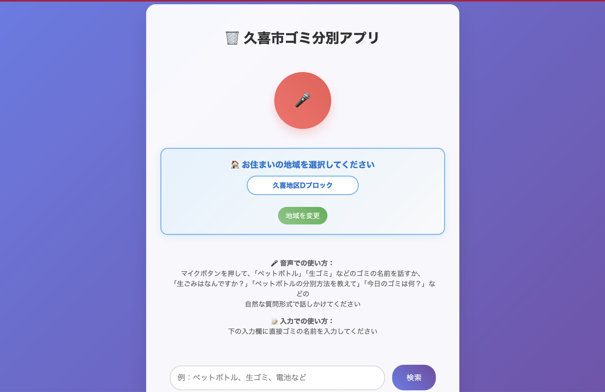

# 久喜市ゴミ分別音声アプリ

[](https://opensource.org/licenses/MIT)
[](https://www.docker.com/)
[](https://developer.mozilla.org/ja/docs/Web/Progressive_web_apps)
[](http://makeapullrequest.com)

埼玉県久喜市のゴミ分別ルールを音声で案内するProgressive Web Application（PWA）です。久喜市公式ごみ分別辞典サイト「ごみサク」の公開情報に基づき、音声認識と音声案内機能で直感的にゴミの分別方法を検索できます。



> **⚠️ 重要な注意事項**  
> これは **個人開発のアプリケーション** であり、久喜市公式のアプリではありません。  
> 詳細な免責事項は文末をご確認ください。

## 🌟 主な機能

### 🏠 地域対応機能
- **14地域対応**: 久喜地区（A-D）、菖蒲地区（A-B）、鷲宮地区（A-D）、栗橋地区（A-D）の全ブロック
- **地域別収集日**: 各地区の詳細な収集スケジュールに完全対応
- **地域選択制**: 初回起動時は地域未選択、ユーザーが選択後は設定を永続保存
- **収集日案内**: 「今日のゴミは何？」で地域別収集情報を音声案内

### 🎤 音声認識機能
- **ハンズフリー検索**: マイクボタンを押してゴミの名前を話すだけ
- **高精度認識**: 日本語音声認識に最適化、自然な質問形式に対応
- **類似語対応**: 方言や言い回しの違い、発音の揺れにも対応
- **収集日音声検索**: 「今日のゴミは何？」「明日のゴミはなんですか？」に対応

### 🔊 音声案内
- **自動読み上げ**: 検索結果を自然な日本語で音声案内
- **詳細説明**: 出し方の注意点も音声で詳しく説明
- **対話型応答**: 自然な会話形式での案内メッセージ

### 🔍 高度な検索機能
- **インテリジェント分別**: プラスチックなど複雑な分別ルールを詳細案内
- **完全一致・部分一致**: 柔軟な検索アルゴリズム
- **キーワードマッピング**: 一般的な表現から正確な分別カテゴリを特定

### 📊 データソース・信頼性
- **公式準拠**: 久喜市公式ごみ分別辞典サイト「ごみサク」（gomisaku.jp）の公開情報に基づく
- **地区別対応**: 久喜・菖蒲・鷲宮・栗橋の4地区すべてに対応
- **10の分別種別**: 燃やせるごみ、燃やせないごみ、資源プラスチック類、びん・缶・ペットボトル等
- **最新情報**: 2025年6月時点の公式情報を反映

### 💻 モダンなWebアプリ
- **PWA対応**: ホーム画面に追加してアプリのように使用可能
- **オフライン機能**: Service Workerによるキャッシュ機能
- **レスポンシブ**: PC・タブレット・スマートフォンに完全対応
- **高速**: 軽量設計で素早い動作、Docker対応

### 🎯 ユーザビリティ
- **収集カレンダー**: 地区別14日間の収集予定を表示
- **次回収集日表示**: 検索結果に次回収集日も併記
- **クイック検索**: 人気のアイテムをワンクリック検索
- **美しいUI**: グラデーションとアニメーションで視覚的にわかりやすい
- **地域情報表示**: 現在設定されている地域名を常時表示

## 🚀 使い方

### 地域設定（初回のみ）
1. ページ上部の「地域を選択してください」をクリック
2. 居住地区（A-Dブロック）を選択
3. 設定は自動保存され、次回アクセス時も記憶されます

### 音声での検索
1. マイクボタン（🎤）をクリック
2. ゴミの名前を話す（例：「ペットボトル」「プラスチック」「生ゴミ」）
3. 自動で分別方法が表示・音声案内される

### 収集日の確認
1. 「今日のゴミは何？」「明日のゴミはなんですか？」と話す
2. 設定した地域の収集スケジュールで回答される
3. 地域名も一緒に表示されます

### テキストでの検索
1. 入力欄にゴミの名前を入力
2. 検索ボタンをクリックまたはEnterキー
3. 分別方法が表示される

### クイック検索
- よく検索される項目のボタンをクリックして即座に検索

## 📱 対応ブラウザ

- Chrome（推奨）
- Safari
- Firefox
- Edge

※音声認識機能は一部のブラウザでのみ利用可能です

## 🛠️ 開発・実行環境のセットアップ

このアプリケーションは **Docker** を使用して統一的に開発・実行できます。

### 必要なソフトウェア
- [Docker](https://www.docker.com/get-started) 
- [Docker Compose](https://docs.docker.com/compose/install/)
- Git

### 🐳 Dockerを使用した開発環境のセットアップ（推奨）

#### 1. リポジトリのクローン
```bash
git clone https://github.com/atsushi-ambo/kuki-trash-app.git
cd kuki-trash-app
```

#### 2. Docker Composeで起動
```bash
# 開発用サーバーを起動（ポート3000）
docker-compose up -d

# ログの確認
docker-compose logs -f

# アプリケーションにアクセス
# http://localhost:3000
```

#### 3. 個別のDockerコマンドでの起動
```bash
# イメージをビルド
docker build -t kuki-trash-app .

# コンテナを起動（ポート3000）
docker run -d --name kuki-trash-app-container -p 3000:80 kuki-trash-app

# アプリケーションにアクセス
# http://localhost:3000
```

### 🔄 開発時のコマンド

```bash
# コンテナの停止
docker-compose down

# コンテナの再起動
docker-compose restart

# ログの確認
docker-compose logs kuki-trash-app

# コンテナの状態確認
docker-compose ps

# イメージの再ビルド
docker-compose up -d --build
```

### 🧪 テストの実行

```bash
# テストコンテナでの実行
docker run --rm -v $(pwd):/app -w /app node:18-alpine npm test

# または、実行中のコンテナ内でテスト
docker exec -it kuki-trash-app-container sh
# コンテナ内で: node test.js
```

### 🔍 デバッグとトラブルシューティング

```bash
# コンテナ内でシェルを起動
docker exec -it kuki-trash-app-container sh

# コンテナの詳細情報
docker inspect kuki-trash-app-container

# リソース使用量の確認
docker stats kuki-trash-app-container
```

### 📱 ローカル開発用の追加機能

開発時に便利な以下のページも利用できます：

- `http://localhost:3000/voice-region-test.html` - 音声認識地域機能のテスト
- `http://localhost:3000/test-summary.html` - 実装状況の確認
- `http://localhost:3000/debug-region.html` - 地域機能のデバッグ

## 📋 ゴミ分別カテゴリ

### 主要カテゴリ
- **燃やせるごみ**: 生ゴミ、紙くず、布類、革・ゴム製品など
- **燃やせないごみ**: 金属類、ガラス・陶磁器、小型家電など
- **資源プラスチック類**: ペットボトル、プラスチック容器、発泡スチロールなど
- **びん・缶・ペットボトル**: 飲料缶、食品缶、ガラスびんなど
- **紙類**: 新聞、雑誌、ダンボール、紙パックなど
- **布・衣類**: 古着、タオル、シーツなど
- **有害ごみ**: 電池、蛍光灯、体温計など

### 地区別対応
- **久喜地区**: A・B・C・Dブロック
- **菖蒲地区**: A・Bブロック  
- **鷲宮地区**: A・B・C・Dブロック
- **栗橋地区**: E・F・G・Hブロック

### 収集方法
- **定期収集**: 週1〜2回の定期収集
- **回収ボックス**: 常設回収ボックスでの随時回収
- **事前申込**: 粗大ごみ等の事前申込制

## 🗓️ 収集日について

地区・ブロックによって収集日が異なります。アプリで地域を設定すると、音声で「今日のゴミは何？」と聞くだけで収集予定を確認できます。

### 収集頻度
- **燃やせるごみ**: 週2回
- **燃やせないごみ**: 月1回（第2土曜日または第4土曜日）
- **資源プラスチック類**: 週1回
- **びん・缶・ペットボトル**: 週1回
- **紙類**: 月2回（第1・第3火曜日または第2・第4火曜日）
- **布・衣類**: 月1回
- **有害ごみ**: 常設回収ボックス（随時）

### 出し方のルール
- **時間**: 朝8時30分まで
- **場所**: 指定された収集場所
- **袋**: 透明または半透明の袋を使用

## 🔧 技術仕様

- **フロントエンド**: HTML5, CSS3, JavaScript (ES6+)
- **音声認識**: Web Speech API
- **音声合成**: Speech Synthesis API
- **データ管理**: ローカルストレージ + 静的JSONデータ
- **PWA機能**: Service Worker, Web App Manifest
- **コンテナ**: Docker + Nginx
- **地域対応**: 14地域の収集スケジュール対応

## 🐳 本番環境でのDocker活用

### 本番デプロイメント
```bash
# 本番用イメージのビルド
docker build -t kuki-trash-app:production .

# 本番環境での起動
docker run -d --name kuki-trash-app-prod \
  -p 80:80 \
  --restart unless-stopped \
  --health-cmd="curl -f http://localhost/ || exit 1" \
  --health-interval=30s \
  kuki-trash-app:production
```

### クラウドデプロイメント例
```bash
# AWS ECS, Azure Container Instances, GCP Cloud Runなどで利用可能
# Docker Hubへのプッシュ
docker tag kuki-trash-app:production atsushi-ambo/kuki-trash-app:latest
docker push atsushi-ambo/kuki-trash-app:latest
```

## 📝 TODO

- [x] PWA対応（オフライン機能）
- [x] 地域別収集スケジュール対応
- [x] 音声認識地域情報統合
- [x] Docker環境整備
- [x] Amazon Alexa スキル完成（Alexa-hosted Skills対応）
- [ ] Google Assistant アクション開発
- [ ] 多言語対応
- [ ] ゴミ出し忘れ通知機能
- [ ] 収集カレンダー表示機能

## 🎯 Alexaスキル開発

`alexa-skill/` フォルダにAmazon Alexaスキルの開発環境が含まれています。現在のWebアプリの検索ロジックとデータベースをそのまま活用できる設計になっています。

### ローカル開発・テスト

```bash
# Alexaスキルのテスト
cd alexa-skill/lambda
npm install
npm test
```

### デプロイ方法

#### 🆓 Alexa-hosted Skills（推奨・完全無料）

Amazon Alexaが提供する **完全無料のホスティングサービス** です。追加料金なしでAlexaスキルを公開できます。

```bash
# 1. Alexa Developer Console (developer.amazon.com/alexa/console/ask) でスキル作成
#    - スキル名: 久喜市ゴミ分別アプリ
#    - 言語: Japanese  
#    - Experience: Other
#    - Model: Custom
#    - Hosting: 🆓 Alexa-hosted (Node.js) ← 完全無料オプション

# 2. alexa-skill/lambda/ のファイルをDeveloper Console内のエディタにコピー

# 3. alexa-skill/interactionModel.json を Build タブでインポート

# 4. テスト・公開（久喜市の人口規模なら完全に無料枠内で運用可能）
```

**無料枠の詳細:**
- 🎯 AWS Lambda: 月間100万リクエスト無料
- 💾 DynamoDB: 25GBまで無料  
- 📁 S3ストレージ: 5GBまで無料
- 🌐 データ転送: 15GB/月まで無料
- ✅ 久喜市の人口約15万人→仮に1日1000リクエストでも月間3万リクエスト程度

#### 手動デプロイ（上級者向け・有料）
```bash
# 1. lambda フォルダをZIPファイルにする
cd alexa-skill/lambda
zip -r ../kuki-alexa-skill.zip .

# 2. AWS Lambda Consoleでアップロード
# - 新しいLambda関数を作成
# - Runtime: Node.js 18.x
# - ZIPファイルをアップロード
```

#### 3. Alexa Developer Consoleでの設定
1. https://developer.amazon.com/alexa/console/ask にアクセス
2. 新しいスキルを作成
3. **「Alexa-hosted (Node.js)」を選択** ← 重要！
4. `interactionModel.json` を使用してスキルを設定
5. ホスティングは自動で設定される（無料）

**注意**: AlexaスキルはAWS Lambda用に設計されており、ローカルDockerコンテナでの実行は不要です。

## 🔐 セキュリティ

このプロジェクトはパブリックリポジトリでの公開を想定して設計されています：

- 🔒 APIキーや機密情報は含まれていません
- 🔒 すべてのデータは静的ファイルまたは公開情報です
- 🔒 ユーザーデータはローカルストレージにのみ保存
- 🔒 外部API依存なし（ブラウザAPI以外）

詳細は [SECURITY.md](SECURITY.md) をご覧ください。

## 📄 ライセンス・免責事項

### ライセンス
MIT License

### 免責事項・重要な注意点
> **⚠️ 重要**  
> 本アプリケーションは **個人開発プロジェクト** であり、**久喜市公式のアプリケーションではありません**。  
> ゴミ分別情報の正確性については保証いたしません。最終的な分別判断は利用者の **自己責任** でお願いします。  
> 最新・正確な情報は [久喜市公式サイト](https://www.city.kuki.lg.jp/) でご確認ください。

## 🤝 貢献

プルリクエストやイシューの報告を歓迎します！
